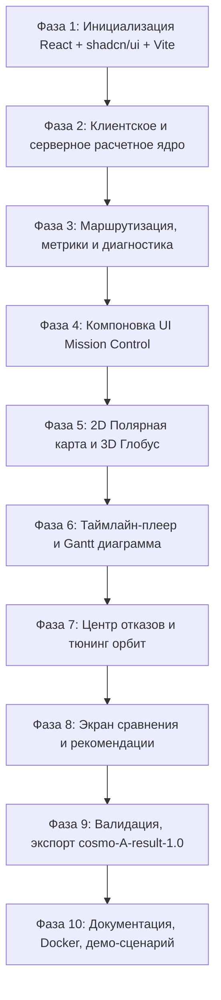

# План реализации: Веб-сервис проектирования устойчивой спутниковой группировки связи (CosmoHack 2026)

Комплексный проект для инженера-проектировщика по анализу устойчивости низкоорбитальной группировки (48 спутников, 550 км, 87° наклонение, 3 плоскости × 16 спутников, 3 очереди запуска) и обеспечения связи абонентов в северных районах (Мурманск `G_MUR`, терминалы `C65`, `C70`, `C72`).

## Анализ задачи и исходных данных
- **Заказчик:** ИНТЦ «АКИД», Нижний Новгород, 11–13 сентября 2026 года.
- **Целевой показатель доступности:** $\ge 90\%$ расчетного времени для каждого наземного пункта.
- **Горизонт расчета:** 86 400 секунд (сутки), шаг 120 секунд (всего 720 временных отсчетов).
- **Специфика условий:** Наземные пункты не могут ретранслировать трафик (транзит только через спутники). Межспутниковые связи (ISL) ограничены дальностью (2000-3000 км) и прямой видимостью без затенения Землей ($R = 6371\text{ км}$).
- **Результаты анализа базовых сценариев:**
  - `01_full_constellation`: 96.7% - 98.9% доступности (цель выполнена).
  - `02_first_launch`: 12.6% - 27.2% (критический дефицит аппаратов, перерывы до 13 часов).
  - `03_satellite_outages`: 79.3% - 82.5% (отказ 10 аппаратов разрушает непрерывность ISL).
  - `04_link_range`: 62.2% - 77.5% (дальность 2000 км приводит к сетевой фрагментации при 100% видимости спутников).

---

## Предлагаемая архитектура и дизайн-система

### 1. Визуальный стиль: Aerospace Mission Control Center
- Стек интерфейса: **React 19 / 18 + TypeScript + Vite + Tailwind CSS + shadcn/ui + Lucide Icons**.
- Палитра: глубокая космическая тема (Deep Slate `#0b0f19`, Card `#111827`, Border `#1e293b`), неоновые акценты (Electric Cyan для спутников, Glowing Blue для ISL, Electric Emerald для активного маршрута, Amber для абонентов, Violet для Мурманска, Crimson для отказов).
- Моноширинная телеметрия (`JetBrains Mono` / `Geist Mono`) с выравниванием `tabular-nums`.

### 2. Двухрежимная визуализация космического сегмента
- **2D Арктическая азимутальная полярная проекция:** неискаженное отображение высоких широт (65°–72° с.ш.), конусов радиовидимости ($\ge 10^\circ$), сетки ISL и активного пути передачи.
- **3D Интерактивный глобус (WebGL / Three.js / Canvas 3D):** 3D модель Земли, орбитальные кольца с наклоном 87°, пространственная геометрия спутниковых созвездий и лучей.

### 3. Интерактивный временной док и Gantt-диаграмма
- Плавный скраббинг от 0 до 86 400 секунд (24 часа) с мультипликаторами скорости (1x, 5x, 30x, 120x, 600x).
- 3-полосная лента доступности для `C65`, `C70`, `C72` с цветовой индикацией:
  - *Зеленый:* сквозной маршрут активен.
  - *Желтый:* спутник виден, но сеть фрагментирована (ISL Partition).
  - *Красный:* нет спутника над терминалом.
- Мгновенный переход к любому моменту кликом по временной диаграмме.

### 4. Интеллектуальный диагностический модуль и устойчивость
- Поиск кратчайшего пути (Dijkstra / BFS минимальных хопов) и альтернативных путей.
- Детектор причин разрыва связи:
  1. `NO_VISIBLE_SATELLITE`
  2. `ISL_MESH_PARTITION`
  3. `GATEWAY_NO_SATELLITE`
  4. `GATEWAY_OUTAGE`
- Поиск критических аппаратов (Cut-vertices/Bridges), отказ которых вызывает потерю маршрута.

### 5. Сравнение проектов и генератор рекомендаций
- Экран сопоставления двух конфигураций с подсветкой дельты показателей ($\Delta$ Доступность %, $\Delta$ Макс. перерыв).
- Аналитический отчет с обоснованием проектных решений для 5-минутного питча жюри.

### 6. Полная поддержка спецификации данных
- Валидация входных JSON по схеме `cosmo-A-1.0`.
- Экспорт результатов моделирования по строгому формату `cosmo-A-result-1.0`.

---

## План разработки по фазам



### Структура проекта
```
c:\Users\gg\Desktop\New Hack\
├── Данные/                         # Сценарии 01, 02, 03, 04
├── Расчетный модуль/               # geometry.py
├── frontend/                       # React 19 + TypeScript + Vite + shadcn/ui
│   ├── src/
│   │   ├── components/             # UI, карта, сайдбары, таймлайн, сравнение
│   │   ├── core/                   # Математическое ядро TS, роутер, диагностика
│   │   ├── stores/                 # Управление состоянием (Zustand)
│   │   └── App.tsx
├── backend/                        # FastAPI сервер (валидация, экспорт, CLI)
├── PLAN.md                         # Полный стратегический документ
├── README.md                       # Руководство по запуску для экспертов
└── docker-compose.yml              # Запуск в 1 команду
```

## Верификация
- Тестирование математического движка на совпадение с эталоном `geometry.py`.
- Проверка базовых сценариев проверки (01, 02, 03, 04).
- Проверка генерации выходного файла `cosmo-A-result-1.0` на соответствие схеме.
- Проверка быстродействия UI (60 FPS скраббинг).
