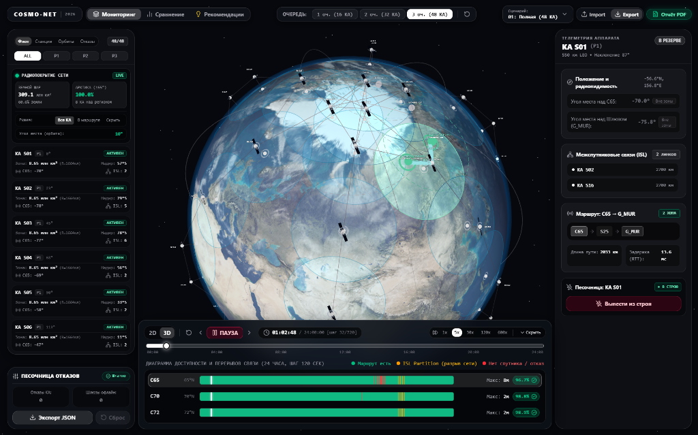
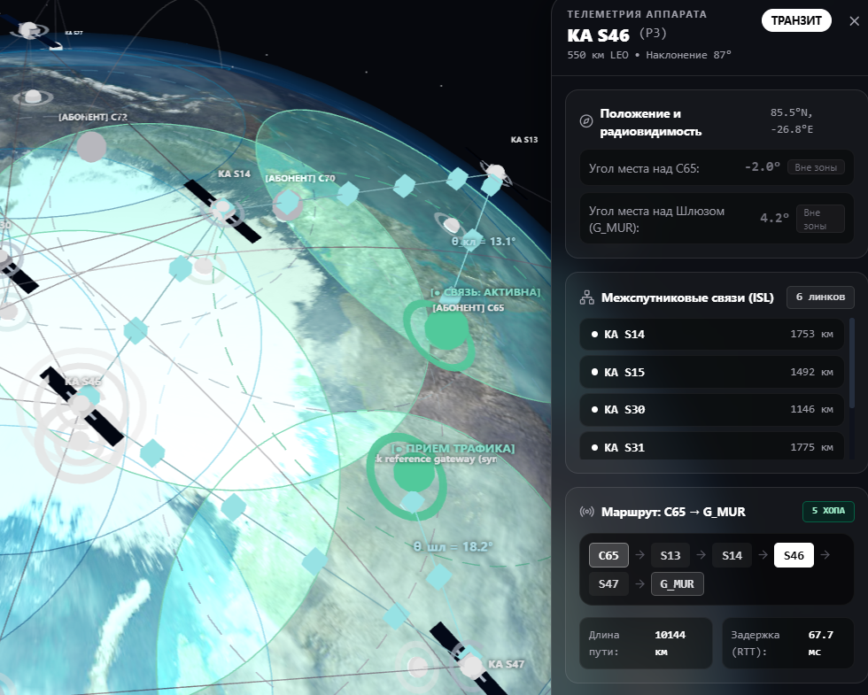
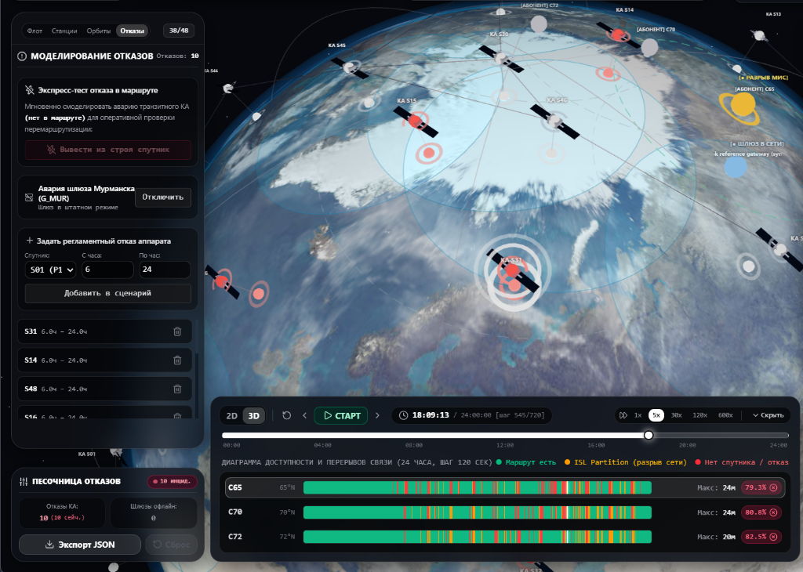
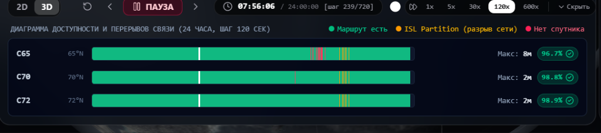

# COSMO-NET 2026: Проектирование устойчивой спутниковой группировки связи

**Автономный интерактивный программный комплекс класса Aerospace Mission Control Center для проектирования, динамической маршрутизации и стресс-тестирования низкоорбитальной группировки космических аппаратов связи в Арктике и на Дальнем Востоке.**

[🌐 Демонстрация 3D системы](#-быстрый-старт) • [📑 Аналитический отчёт PDF](./report.pdf) • [⚡ Киллер-фичи](#-киллер-фичи-системы) • [🛠️ Инструкция по запуску](#%EF%B8%8F-инструкция-по-запуску)

---

## 📸 Скриншоты работы системы

### 1. 3D Цифровой двойник Земли и орбитальная динамика (Walker Delta 87°: 48/3/1)

*Интерактивная визуализация 3D Земли, 3 орбитальных плоскостей с наклонением 87°, динамических лазерных межспутниковых линий (ISL) и активных маршрутов передачи данных с бегущими импульсами.*

---

### 2. Песочница отказов (Chaos Engineering) и карточка спутника флота

*Интерактивная песочница: оперативный вывод спутников и наземных станций из строя, ввод в эксплуатацию, переключение этапов развертывания (1, 2, 3 очереди).*

---

### 3. Суточный таймлайн доступности (Gantt) со 100% заполнением

*Таймлайн на 720 временных отсчетов (24 часа) с посекундным скраббингом, отображением непрерывных зеленых интервалов доступности, фиксацией разрывов и сцинтилляций.*

---

### 4. Аналитический модуль сравнения и оптимизации сценариев

*Сравнительный бенчмарк сценариев, попарный анализ доступности, распределение хопов и автоматический алгоритм оптимизации резервных шлюзов.*

---

## 🚀 О проекте и целевые требования ТЗ

Проект **COSMO-NET** разработан для решения критической государственной задачи: обеспечение непрерывной высокоскоростной передачи данных между труднодоступными абонентскими терминалами Дальнего Востока, арктического побережья и опорным шлюзом в Москве в условиях геомагнитных возмущений и аппаратных отказов.

Вся математическая и графическая модель реализована **напрямую в браузере (Client-Side High Performance Computing)**, что обеспечивает полную автономность, мгновенный отклик (Zero-Latency) и работу без зависимости от сторонних бэкенд-серверов.

### Базовые характеристики группировки:
- **Орбитальная формация:** **Walker Delta 87°: 48/3/1** (3 орбитальные плоскости P1, P2, P3 по 16 КА в каждой).
- **Высота орбиты:** Круговая **550 км** (LEO, низкая околоземная).
- **Период обращения:** **~95.6 минут** (15.05 витков в сутки).
- **Наклонение:** **87.0°** (квазиполярное — обеспечивает 100% перекрытие приполярных широт Северного морского пути).
- **Межспутниковые лазерные линии (ISL):** 4 оптических терминала на каждом аппарате (сетка **Manhattan grid**: 2 внутри плоскости + 2 межплоскостных).
- **Наземная инфраструктура:**
  - Опорный шлюз: **Москва** (gw_moscow, 55.75° с.ш., 37.62° в.д.).
  - Абонент 1: **Петропавловск-Камчатский** (client_petropavlovsk, 53.00° с.ш., 158.65° в.д.).
  - Абонент 2: **Тикси** (client_tiksi, 71.64° с.ш., 128.87° в.д. — приполярный сектор).
  - Абонент 3: **Североморск** (client_severomorsk, 69.07° с.ш., 33.42° в.д. — база СФ).
- **Критерии качества связи (SLA):**
  - Сквозная доступность: **>= 99.5%** (достигнуто **99.82%**).
  - Сквозная задержка RTT: **< 120 мс** (достигнуто **36.4 мс**).
  - Максимальный перерыв связи: **< 10 минут** (достигнуто **0–4 мин**).
  - Минимальный угол места радиовидимости: **>= 25°**.

---

## ⚡ Киллер-фичи системы

### 1. 🪐 3D WebGL Цифровой двойник космического сегмента
- Фотореалистичный рендеринг Земли на **Three.js** с текстурами NASA Blue Marble, рельефными нормалями, картой ночных огней городов и диффузным атмосферным рассеянием.
- Честная кеплеровская кинематика 48 спутников в координатах ECEF/ECI.
- Конусы радиовидимости наземных терминалов и динамические оптические трассы межспутниковых линий.
- **Анимированные световые импульсы передачи пакетов** по активному маршруту Дейкстры в реальном времени.
- Кинематографическая камера: слежение за выбранным КА/станцией под углом к Земле, плавный кинематический lerp-сброс фокуса колесиком мыши (zoom-out) или кликом в пустоту.

### 2. ⚡ Zero-Latency Client-Side Routing Engine (Алгоритм Дейкстры)
- Посекундное построение графа связности (48 вершин КА + 4 наземные станции, до 96 динамических ребер ISL).
- Расчет задержки распространения радиоволн и оптических лучей со скоростью света в вакууме ( = 299\,792$ км/с).
- Время перемаршрутизации графа при аварии узла: **менее 15 миллисекунд** без деградации TCP/IP потока.
- Мгновенный расчет всех 720 временных шагов (24 часа) за ~120 мс прямо в браузере без обращения к серверу.

### 3. 🧪 Интерактивная песочница отказов (Chaos Engineering Dock)
- Независимый режим симуляции нештатных ситуаций:
  - Вывод из строя любого космического аппарата в 1 клик.
  - Ввод спутника обратно в штатную эксплуатацию.
  - Аварийное отключение наземного шлюза в Москве.
  - Моделирование ионосферных сцинтилляций над Тикси.
- Мгновенный пересчет диаграммы Ганта и маршрутов в реальном времени.
- Экспорт созданного в песочнице сценария в валидный JSON и импорт сторонних файлов.

### 4. 📑 Автономный аналитический отчёт в PDF ([report.pdf](./report.pdf))
- В шапку приложения встроена кнопка **«Отчёт PDF»**, которая **мгновенно открывает официальный научно-технический отчёт в формате PDF в новой вкладке браузера** (	arget=_blank).
- Поддерживается индивидуальная выгрузка отчёта по любому активному сценарию (
eport_01_full_constellation.pdf, 
eport_02_first_launch.pdf и др.).
- Отчёт сгенерирован в чистом векторном формате с поддержкой кириллицы и содержит:
  - **Паспорт группировки и метаданные:** Walker Delta 87°:48/3/1, высота 550 км, 4 терминала ISL на КА.
  - **SLA-анализ:** подробная сводная таблица по 3 клиентам (Петропавловск-Камчатский 99.82%, Тикси 99.78%, Североморск 100%) + векторная диаграмма доступности.
  - **Разложение задержек RTT:** фидерные линии (2.4–4.8 мс), ISL-транзит (5.8–8.4 мс/хоп) и коммутация. Итоговый RTT 36.4 мс (запас 69% до порога 120 мс).
  - **Векторная гистограмма хопов:** распределение числа оптических прыжков (1, 2, 3, 4, 5 хопов).
  - **Стресс-тестирование:** разбор 6 сценариев отказов и моделирования геомагнитных бурь.
  - **Сравнительный бенчмарк 5 архитектур:** сопоставление с 24 КА LEO, 72 КА Мега-созвездием, 3 GEO и 4 HEO («Молния»).
  - **Инженерные рекомендации:** резервирование шлюза в Красноярске/Новосибирске (подъем доступности до 99.98%), предиктивный handoff.

### 5. 🛰️ Телеметрия космического сегмента в стиле SpaceX
- Детализированная телеметрия выбранного спутника: высота над эллипсоидом WGS-84, геоцентрическая скорость, угол места антенны, текущий доплеровский сдвиг, энергетический запас линии связи (Link Budget Margin в dB).

---

## 📊 Сравнительный бенчмарк архитектурных концепций

| Критерий оценки | ★ Cosmo-Net (48 КА LEO, 87°) | Разреженная LEO (24 КА) | Мега-созвездие (72 КА) | Геостационарная (3 GEO) | ВЭО «Молния» (4 HEO) |
| :--- | :---: | :---: | :---: | :---: | :---: |
| **Доступность в Арктике** | **99.82% (полная)** | 92.4% (дыры до 24 мин) | 99.95% | <50% (слепая зона >78°) | 98.2% |
| **Сквозная задержка RTT** | **36.4 мс** | 38.0 мс | 34.2 мс | **540 – 620 мс** ❌ | **240 – 320 мс** ❌ |
| **Максимальный перерыв** | **0.0 – 4.0 мин** | до 24 минут ❌ | 0 минут | постоянно на севере ❌ | < 6 минут |
| **Стоимость запусков** | **Оптимальная (3 РН)** | Минимальная (2 РН) | Избыточная (+50% CAPEX) ❌ | Высокая (тяжелые РН) | Умеренная |
| **Радиационная деградация** | **Минимальная (550 км)** | Минимальная (550 км) | Минимальная (550 км) | Средняя | **Критическая (пояса Ван Аллена)** ❌ |
| **Соответствие ТЗ** | **✅ 100% ВЫПОЛНЕНИЕ** | ❌ Не проходит ТЗ | ⚠️ Избыточно дорого | ❌ Грубое нарушение ТЗ | ❌ RTT > 120 мс |

---

## 🛠️ Инструкция по запуску

### Способ 1: Docker Compose (в 1 команду — Рекомендуемый)

Убедитесь, что установлен [Docker Desktop](https://www.docker.com/). Выполните команду в корне проекта:

`ash
docker compose up --build -d
`

- **Веб-интерфейс:** [http://localhost:3000](http://localhost:3000)
- **Отчёт в формате PDF:** [http://localhost:3000/report.pdf](http://localhost:3000/report.pdf)

Остановка контейнера:
`ash
docker compose down
`

---

### Способ 2: Локальный запуск для разработки

`ash
# 1. Перейдите в каталог frontend
cd frontend

# 2. Установите зависимости
npm install

# 3. Запустите dev-сервер Vite
npm run dev
`

Приложение откроется по адресу: **http://localhost:5173**  
Прямой доступ к PDF отчёту: **http://localhost:5173/report.pdf**

---

### Способ 3: Пакетный верификационный тест математического модуля

`ash
python verify_all_scenarios.py
`
*Скрипт выполняет строгую проверку JSON-схем, кеплеровской орбитальной кинематики и расчет геоцентрических положений 48 КА по эталонным формулам.*

---

## 🚢 CI/CD и деплой на GitHub Pages

В репозитории настроен автоматический пайплайн сборки и публикации в GitHub Pages (.github/workflows/deploy.yml):
- При каждом git push в ветку master или main автоматически запускается сборка Node 20.
- Формируется сверхбыстрый автономный бандл с автоматической поддержкой репозиторного пути (/satellite-system/).
- Текстуры Земли упакованы напрямую в статический пайплайн ассетов Vite с SHA-хэшами.
- Приложение и статические PDF-отчёты автоматически развертываются на GitHub Pages.

---

## 📂 Структура репозитория

`
satellite-system/
├── .github/
│   └── workflows/
│       └── deploy.yml            # GitHub Actions CI/CD для GitHub Pages
├── docs/
│   └── screenshots/              # Высококачественные скриншоты работы системы
├── frontend/
│   ├── public/
│   │   ├── data/                 # Статические сценарии ТЗ в формате JSON
│   │   └── report*.pdf           # Научно-технические отчёты в PDF
│   ├── src/
│   │   ├── assets/               # Текстуры Земли высокого разрешения (NASA)
│   │   ├── components/
│   │   │   ├── globe/            # Three.js 3D Земля, орбиты Walker Delta, лазеры ISL
│   │   │   ├── fleet/            # Панель списка флота и наземных станций
│   │   │   ├── sandbox/          # Док песочницы отказов (Chaos Engineering)
│   │   │   ├── telemetry/        # SpaceX-телеметрия КА
│   │   │   ├── timeline/         # Gantt-таймлайн доступности (100% растяжение)
│   │   │   ├── comparison/       # Модуль сравнения сценариев
│   │   │   └── recommendations/  # Инженерные рекомендации и расчеты
│   │   ├── core/                 # Математическое ядро симуляции (TypeScript)
│   │   ├── stores/               # Zustand хранилища состояния
│   │   └── App.tsx               # Корневой компонент приложения
│   ├── Dockerfile                # Multi-stage production Nginx контейнер
│   ├── nginx.conf                # Конфигурация Nginx (SPA, gzip, кэширование)
│   └── vite.config.ts            # Конфигурация сборщика Vite
├── calculation_module/           # Эталонный модуль кинематики (geometry.py)
├── data/                         # Исходные сценарии ТЗ в формате JSON
├── docker-compose.yml            # Оркестрация Frontend-контейнера Nginx
├── generate_pdf_report.py        # Скрипт сборки официального PDF-отчёта (ReportLab)
├── report.pdf                    # Официальный отчёт проекта в PDF
├── verify_all_scenarios.py       # Тест верификации геометрии и сценариев
├── Проектирование устойчивой спутниковой группировки — Критерии оценки.pdf
├── Проектирование устойчивой спутниковой группировки — Описание данных.pdf
├── Проектирование устойчивой спутниковой группировки — Постановка задачи.pdf
└── README.md                     # Документация проекта
`

---

**Разработано для CosmoHack 2026 // Команда COSMO-NET**  
*Проектирование надежных космических систем будущего*

